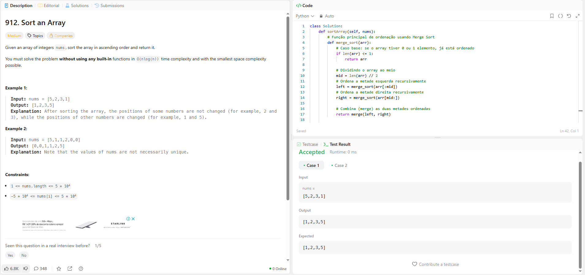
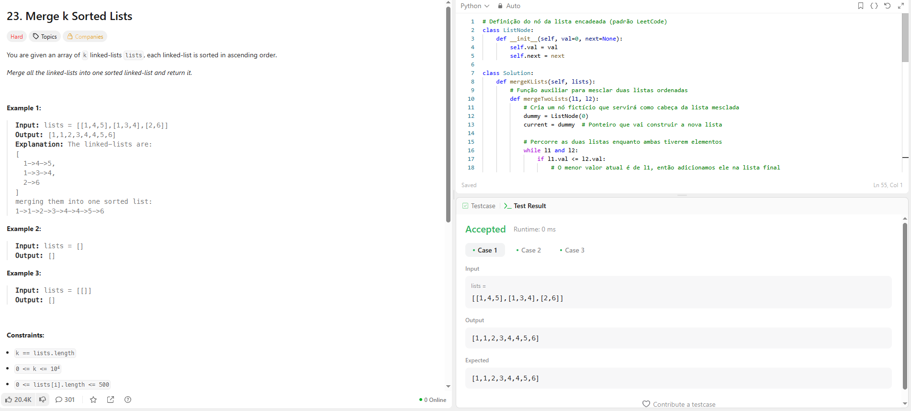
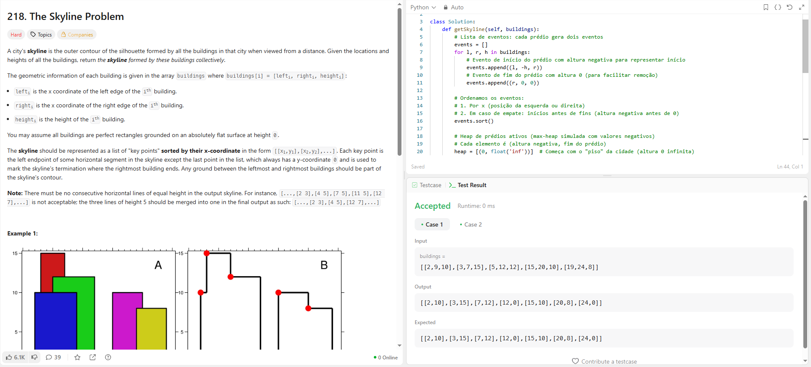
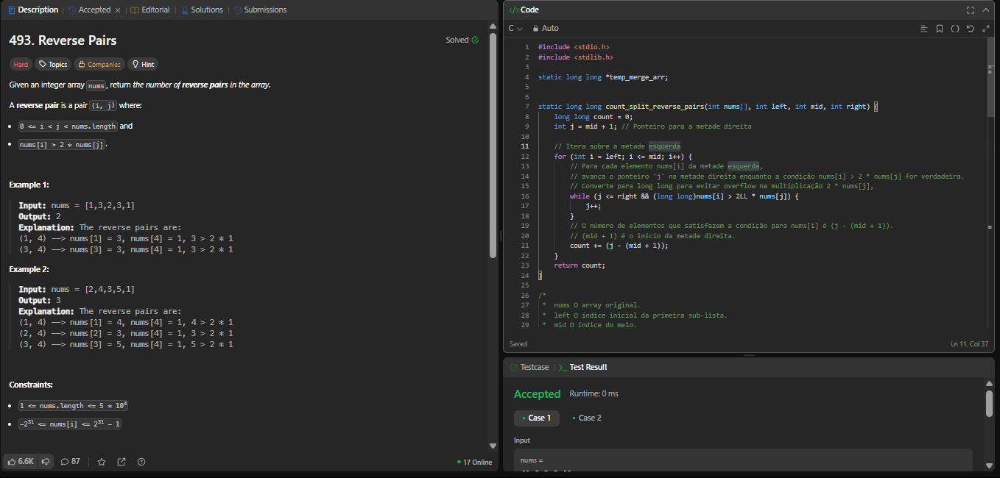

# DC_Leet_Code

**Número da Lista**: 4 
**Conteúdo da Disciplina**: Dividir e Conquistar 

## Alunos
|Matrícula | Aluno |
| -- | -- |
| 22/1022506  |  Cayo Felipe Alencar Câmara |
| 19/0028963  |  Guilherme Brito de Souza |

## Sobre 
Foram realizadas 4 questões do leetcode e uma questão do Beecrowd sobre a abordagem Dividir e Conquistar.

| Problema | Nome                                   | Dificuldade |
|----------|----------------------------------------|-------------|
|  [912](https://leetcode.com/problems/sort-an-array/)         |    Sort an Array                                    | Médio       |
|  [23](https://leetcode.com/problems/merge-k-sorted-lists/description/)        |     Merge k Sorted Lists                                   | Difícil     |
|  [218](https://leetcode.com/problems/the-skyline-problem/)        |    The Skyline Problem                                    | Difícil       |
|   [1088](https://judge.beecrowd.com/pt/problems/view/1088)      |       Bolhas e Baldes                                 | Difícil   |
|    [493](https://leetcode.com/problems/reverse-pairs/description/)     |     Reverse Pairs                                   | Difícil    |
       

## Screenshots
 
### Questão Sort an Array

### Questão Merge k Sorted Lists

### Questão The Skyline Problem

### Questão Bolhas e Baldes

### Questão Reverse Pairs

## Instalação 
**Linguagem**: Python 
**Linguagem**: C 

## Link

Link do vídeo do youtube: 

<iframe width="560" height="315" src="https://www.youtube.com/embed/6OYVPIBYQZQ?si=cbn4UfxNVIcITqsB" title="YouTube video player" frameborder="0" allow="accelerometer; autoplay; clipboard-write; encrypted-media; gyroscope; picture-in-picture; web-share" referrerpolicy="strict-origin-when-cross-origin" allowfullscreen></iframe>
